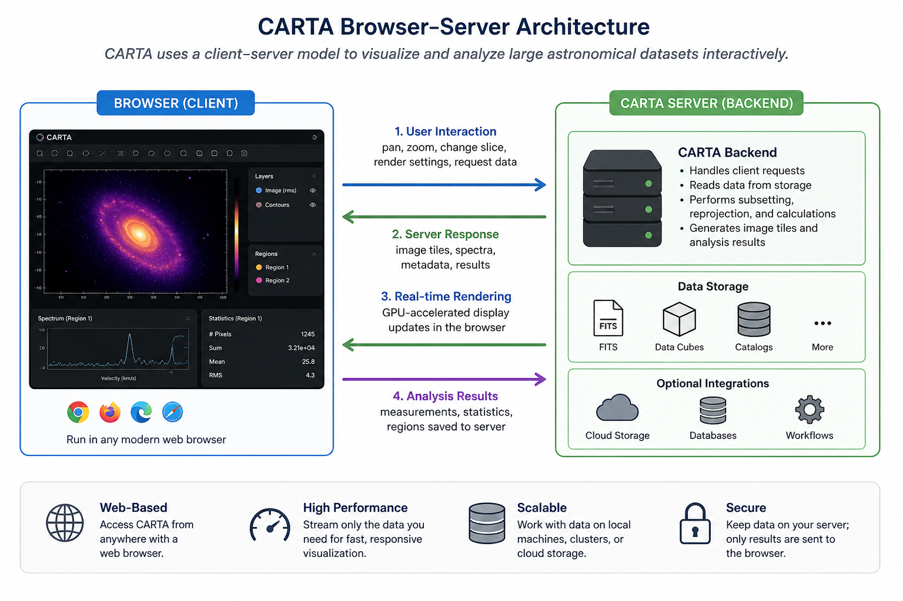
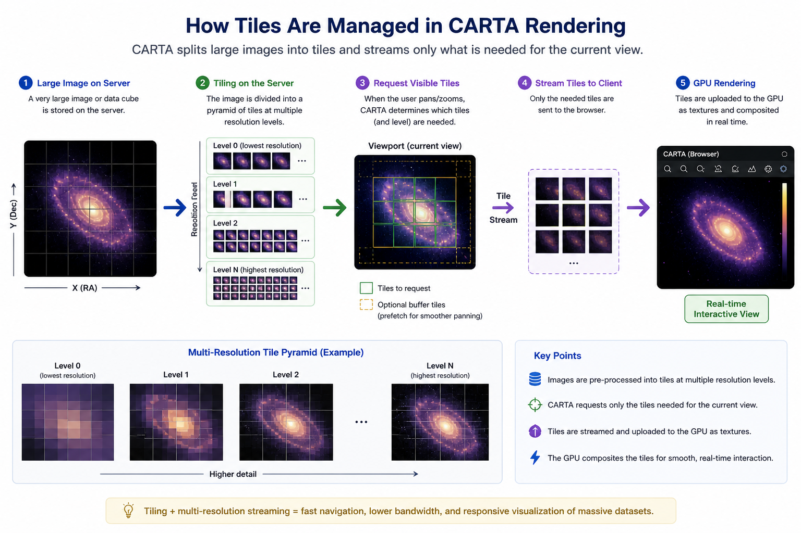

# What is CARTA and why should I use it?

The **CARTA Viewer (Cube Analysis and Rendering Tool for Astronomy) is a powerful, web-based application for visualizing and analyzing astronomical data**. Designed with performance and usability in mind, CARTA enables astronomers to interact seamlessly with large astronomical datasets. It provides high-performance rendering and interactive tools tailored for radio astronomy and beyond.

CARTA is a next-generation image viewer that runs in your web browser while leveraging a backend server for data access and processing. This architecture allows users to work efficiently with large FITS images and multi-dimensional data cubes without needing to download them locally.

It separates the frontend (user interface) from backend services, enabling scalable and remote workflows.

It is therefore, particularly well-suited for radio and millimeter/submillimeter astronomy, where datasets can be extremely large and complex. It has in fact been designed for ALMA, VLA, and SKA pathfinders, but could be used for a broad range of applications. 

## Key Features

- **🖥️ Platform Independence**  
  Run CARTA in any modern browser—no complex installation required for the frontend.

- **🌐 Remote Data Access**  
  Work directly on data stored on servers or clusters without transferring large files to your local machine.

- **⚡ High Performance with Large Data Cubes**  
  CARTA streams data dynamically, allowing smooth interaction even with massive datasets.

- **🔗 Linked Views and Multi-Panel Layouts**  
  Compare multiple images or datasets side-by-side, useful for multi-configuration or multi-wavelength studies.

- **🧭 Responsive Navigation**  
  Instantly pan, zoom, and explore regions of interest without lag, making it easy to move through high-resolution images.

- **🎯 Region-Based Statistics**  
  Define regions and immediately compute statistics, helping with source identification and analysis.

- **📊 Real-Time Spectral Analysis**  
  Extract and visualize spectra from data cubes interactively, ideal for multi-channel observations.

- **✨ CPUs Parallelization in data processing** Process fast and responsive analysis even for complex and high-volume astronomical images or source catalogues.  

- **✨ Real-time rendering with GPU acceleration** (when available) load 1TB of image size with 1GB of ram in seconds 

---

## 🧱 Architecture Overview

CARTA uses a **client-server model**:

- **Frontend (Browser):**  
  Provides an intuitive graphical interface for visualization and interaction.

- **Backend (Server):**  
  Handles file I/O, data processing, and communication with the frontend.

This separation enables scalable workflows and efficient handling of large datasets typical of ALMA and other observatories.

*Figure: Illustration of the CARTA browser–server architecture. User interactions in the browser (e.g., pan, zoom, and analysis requests) are sent to the backend server, which processes the data, generates image tiles and analysis results, and streams them back for real-time, GPU-accelerated rendering in the client.*

## ⚡ GPU-Accelerated Rendering and CPU-Parallelization 

**CARTA achieves real-time rendering by streaming only the required portions of image data** from the backend to the browser and using GPU-accelerated techniques to dynamically update the display as the user pans, zooms, or analyzes the dataset. In this way, CARTA minimizes data transfer and offloads heavy rendering tasks to the GPU, allowing high-performance visualization directly in the browser.

Furthermore, **CARTA leverages CPU parallelization** to efficiently process large datasets and source catalogues by distributing computations across multiple cores, ensuring fast and responsive analysis even for complex and high-volume astronomical data.

*Figure: Illustration of CARTA’s tiled rendering workflow. Large astronomical images are preprocessed into multi-resolution tile pyramids on the server. Based on the user’s viewport (pan/zoom level), only the necessary tiles and resolution levels are requested and streamed to the client. These tiles are uploaded as textures to the GPU and composited in real time, enabling smooth, high-performance interaction with massive datasets while minimizing data transfer.*

---

## 📂 Supported Data

CARTA supports a range of astronomical data formats, including:

- **FITS images and cubes**
- **CASA image formats** (via backend support)
- **HDF5 format** using the IDIA schema 
- **MIRIAD images and cubes**

{: .tip}
CARTA also provides a command-line tool called fits2idia to convert FITS images into the required HDF5-IDIA format)

This makes it suitable for data from:

- ALMA  
- VLA
- ATCA (also the new BIGCAT correlator)
- MeerKAT  
- SKA precursors and pathfinders  
- Optical and infrared observatories  

---

## 📚 Official CARTA Documentation

For comprehensive guides, tutorials, and technical references, visit the official CARTA resources:

- 🌐 **CARTA Website**  
  https://cartavis.org  

- 📖 **Documentation Portal**  
  https://cartavis.org/docs/  

- 🚀 **Getting Started Guide**  
  https://cartavis.org/docs/user_guide/getting_started.html  

- 🧭 **User Guide**  
  https://cartavis.org/docs/user_guide/  

- ⚙️ **Backend Installation & Configuration**  
  https://cartavis.org/docs/backend/  

- 🧑‍💻 **GitHub Repository**  
  https://github.com/CARTAvis/carta  

These resources include:

- Step-by-step tutorials  
- Feature explanations and workflows  
- Backend setup and deployment instructions  
- Developer and API documentation  

[Next: Choose the way to access CARTA →](/pages02_before_to_start.md)

