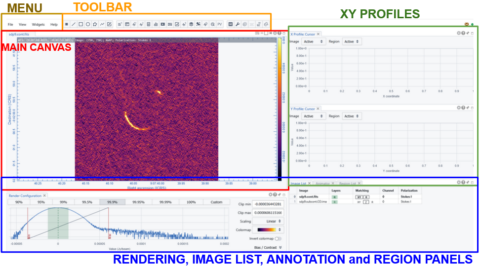
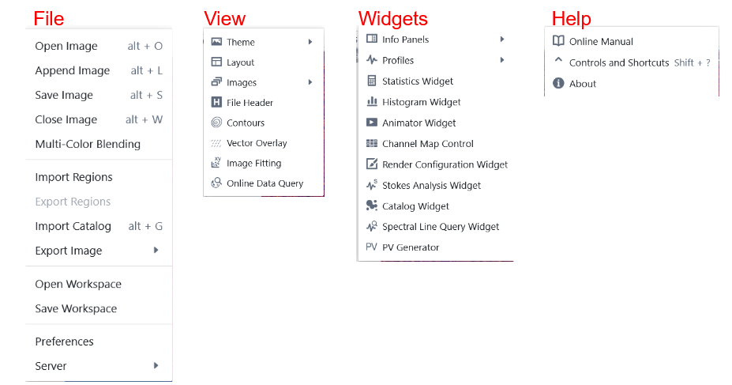
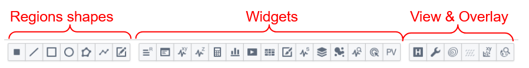
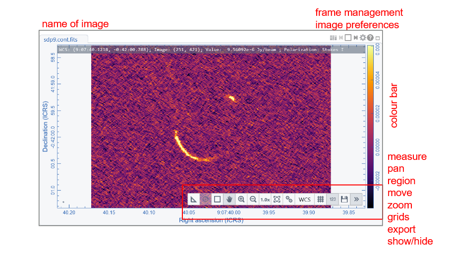
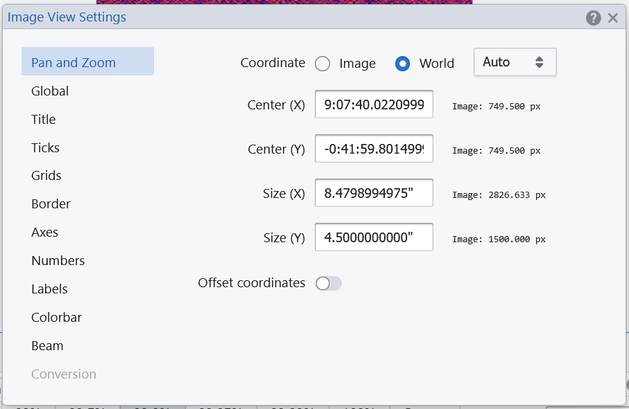
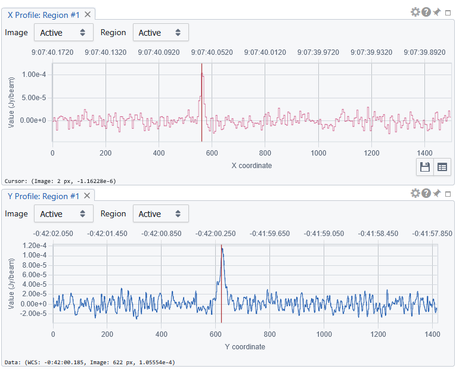

# 🖥️ The CARTA Viewer Interface Guide

The CARTA Viewer layout is designed to maximize usability while giving access to powerful analysis tools.

---

## 🧭 Overview of the Interface

The default CARTA interface is composed of several key panels and tools:

- **Menu and Toolbar**
- **Image Viewer (Main Canvas)**
- **Render configuration Panel**
- **File List, Animator and Region List Panels**
- **xy profiles**

*Figure: Illustration of CARTA initial interface corresponding to the "default layout"
---

## 🧰 Menu and Toolbar

The drop down menu has 4 buttons
- **File**: to manage the image files and load or save regions or catalogues to overlay
- **View**: set the interface layout and the preferences and access the overlay and plotting tools
- **Widgets**: opens all the panels dedicated to the various analysis and rendering actions
- **Help**: access manual and support links

*Figure: Illustration of CARTA menu drop down content

The toolbar provides a quick access to some actions also accessible through the drop down menu. 
By hooverig over the icons the name of the corresponding widget and a two lines manual on how to use it appears.
Icons are grouped into 3 blocks:
- **Region shapes**: allow to select the shape of the region to be drawn
- **Widgets**: a button for each of the widgets avaliable in the homonimous menu button
- **View and plotting overlay tools**: including the link to the header view and to the plotting tool available also with the "View menu"

*Figure: Illustration of CARTA toolbar scheme and Icons

---

## 🖼️ Image Viewer (Main Canvas)

The central area of CARTA is the **image viewer**, where data is displayed.
Appended images are included as different frames. 

A toolbar on the top right of the panel helps managing the various frames. In particular a gear button opens the image preferences panel that includes all the style choices like title, labels, and number formats, grids and line colour and thickness, colorbar position and size, beam shape rapresentation

A toolbar on the bottom right of each frame allows quick action on the active image.
A grey bar on the top part of the image frame includes the coordinates (including Stokes and channel information) and value of the cursor position in the active frame.

---

## 📍 Render configuration Panel

This panel allows the visualization of the pixel distribution.
It also provides options to control how a raster image is rendered in the Image Viewer Widget.

In particular the Render Configuration Widget allows you to 
- set clip values for the image rendering: user can choose between percentage of plotted pixels. They are represented between two vertical lines in the distribution hystogram. Clip range can be defined using pre-defined percentages, or customized within values selected by moving the vertical lines or writing the extremes. 
- decide the scaling to adjust how pixel values within the two clip values are mapped to colors in the colormap.
- set the colour map 
- define the bias and contrast adjustment that is represented as a 2D box in the Render Configuration Widget, where the x-axis represents bias (-1 ~ +1, default 0) and the y-axis represents contrast (0 ~ 2, default 1)
- decide the color for pixels with NaN value.

---
## 📂 File List, Animator and Region List Panels

Three panel are showed to control multiple visualization or overlays
- **file list**: allows to manage image interactions, overlay or matching [→ see Image Management](05_image_management.md)
- **animator**: allows passing from different images, channels or stokes layers [→ see Basic Spectral Analysis](08_spectral_analysis.md) 
- **region list**: controls the list and properties of the different regions generated in the analysis [→ see How to define Regions](pages/06_regions.md)

---

## XY profiles
The default layout is for image navigating including the profiles of pixel values that are touched by an horizontal and vertical line passing through the cursor position.
It is possible to decide which image or region is to be used for defining the profile.
A vertical red line on the profile plot indicate the actual pixel position value.
The usual gear button allows settings of the plot profiles, including smmothing, colours and labels.

---

## 💡 Key Strengths of the Interface

- **Responsive and interactive** even with large datasets  
- **Real-time feedback** for analysis tools  
- **Seamless integration** of visualization and quantitative analysis  
- **Highly customizable layout**  

---

{: .tip}

[← Previous: Choose the way to access CARTA](02_before_you_start.md) [Next: Setting Layouts and Preferences →](04_layouts.md)
