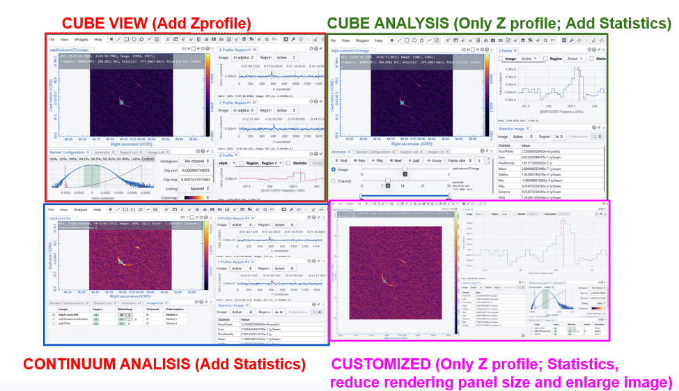
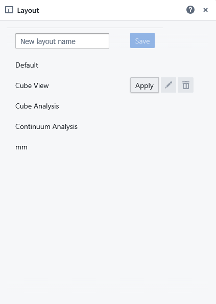
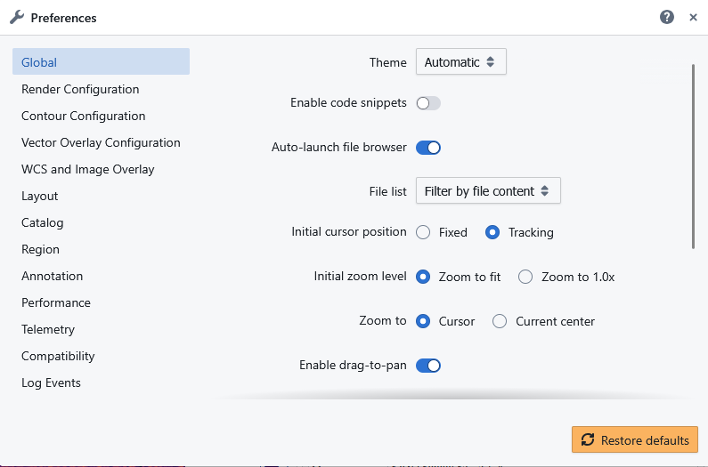

# 🧩 CARTA Viewer Layouts & Preferences

The CARTA Viewer offers a flexible and customizable interface that adapts to different analysis workflows. Users can choose from predefined layouts or create their own, while fine-tuning behavior and appearance through an extensive **Preferences** system.

---

## 🧱 Layout System in CARTA

CARTA uses a **dockable panel system**, allowing users to arrange components dynamically.

### Key Characteristics
- Panels can be **moved, resized, docked, or detached**
- Layouts can be **saved and restored**
- Multiple panels can be viewed simultaneously
- Designed for both simple and advanced workflows

---

## 📐 Common Layout Configurations

Several common layouts are made available through the layout item in the View menu, in addition to the Default interface [see Meeting the interface →](03_interface.md):

To load an existing layout select and apply it in the View -> Layout menu.

Users can open, resize, move, overlap, and set visualization options for each panel.
The resulting layout can be saved by adding a name for it in the dedicated tag of the View -> Layout menu.
They will be added immediately to the same menu among the loadable layouts.

Default, cube view and analysis and continuum analysis cannot be modified or canceled.
Customized layouts can be modified or canceled by clicking on the relative buttons of the View -> Layout menu.

Custom layout files are saved in JSON format within your home directory on the server (either users are using CARTA in Server or Local mode), specifically under ~/.carta/config/layouts

---

## ⚙️ Preferences in CARTA

The **Preferences** panel allows users to control the behavior and appearance of the viewer.
The panel can be opened through the File menu "Preferences" item, or clicking on the magnifying lens icon in the toolbar. 
As a JSON file, the preferences file is kept in ~/.carta/config/preferences.json and will be loaded automatically the next time you will open CARTA.

Details on all the possible preferences that can be set are on [the CARTA guide](https://carta.readthedocs.io/en/latest/preferences.html#). 

The preferences panel collects the setting of appearance parameters of the various panels. Most of the settings are also available through the specific widgets/plotting tool.

---

## 💡 Why Layouts & Preferences Matter

CARTA’s layout and preferences system provides a highly adaptable interface:

- 🧩 **Layouts** → organize tools and views for specific tasks  
- ⚙️ **Preferences** → fine-tune behavior, performance, and appearance  

The combination of flexible layouts and customizable preferences allows CARTA to:

- Adapt to different scientific workflows  
- Improve efficiency and usability  
- Provide a personalized working environment  
- Scale from beginner to expert use  

[← Previous: Meeting the interface](03_interface.md) [Next: Image management→](05_image_management.md)