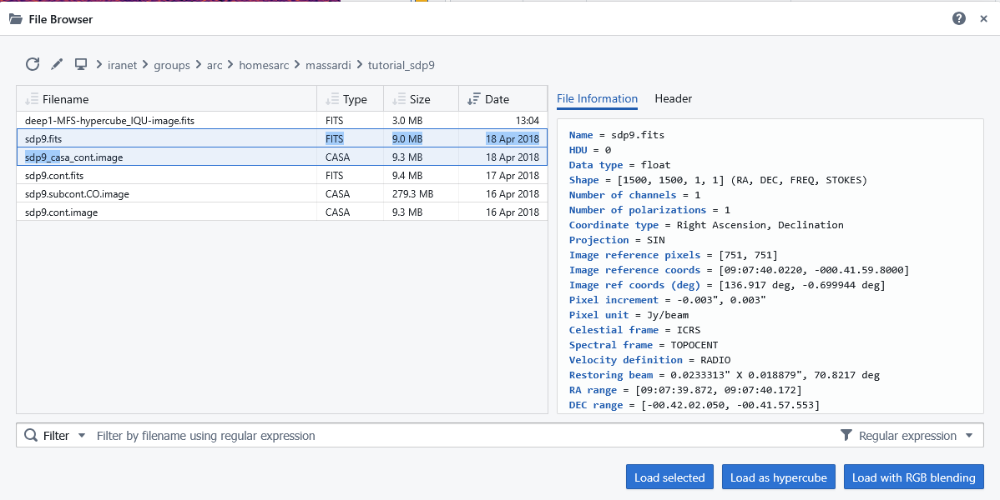
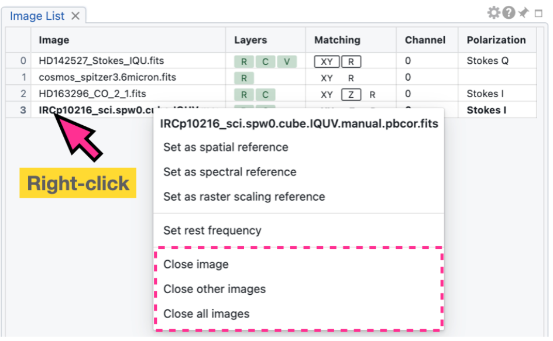
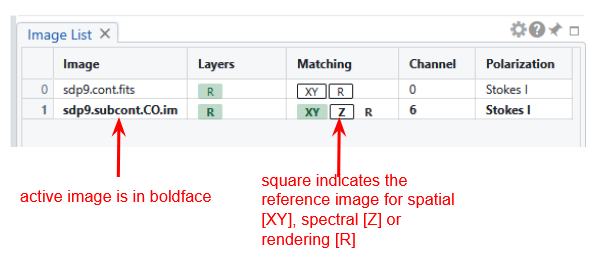
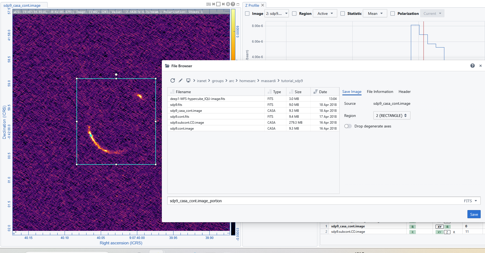
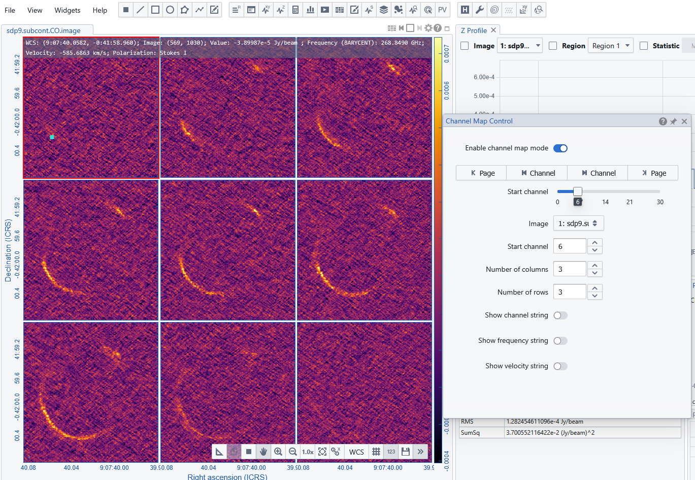
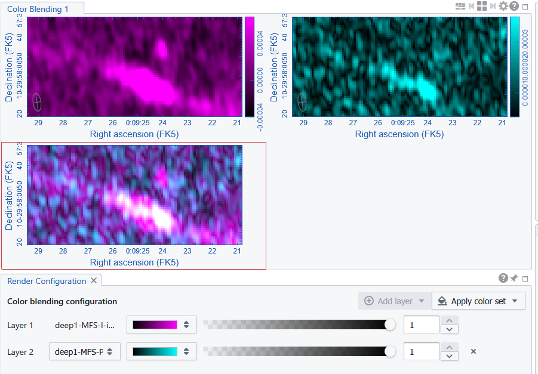

# 🖼️ CARTA Image Management Guide

CARTA provides a flexible and efficient system for managing astronomical images and data cubes. Users can load, organize, compare, and export data through an intuitive interface designed for both simple and advanced workflows.

---

## 📂 Opening Images

Images can be loaded into CARTA from local or remote file systems.

### How to Open an Image
- Use the **File Browser** panel
- Navigate to your data directory
- Select a file (e.g., FITS image or cube)
- Click **Load selected**

(: .tip)
The File Browser reports also the Header and a set of "File Informations" that collects useful properties or numbers automatically calculated from the file header or data tables. 
Among them there is the "Restoring Beam" size that could be reported as Sinthesized Beam size for the image. 

Multiple images can be simultaneously loaded.
In case separate I,Q,U,V images of the same region needs to be loaded for Stokes analysis they must be selected simultaneously and "Load as hypercube".
In case separate images of the same region should be used as different layers of RGB images they must be selected simultaneously and "Load with RGB blending".

The loaded image/Hipercube is displayed in the active viewer (frame), and appears in the File List Panel.
Note that for an hypercube only one image appears loaded, but divverent layers (e.g. Stokes) can be reached through the Animator Panel.

(: .note)
Opening new images will not add them to those currently open, but will close all the open one and replace them with the newly selected ones.

---

## ➕ Appending Images

Appending allows you to load additional images without replacing the current ones ("load image" closes the currently open ones).

### How to Append
- From the File menu select the Append Image item 
- Select another file in the File Browser
- Click **Append** 

The new image is added to the session. It is displayed in a different frame. Frames and images can be navigated through the image viewer top right toolbar, or through the Image List panel.

---

## 🔗 The Image List panel

The image list panel shows the list of appended images. They can be selected to become "active" (the active image is listed in boldface). 

By right-clicking on the image name we can select the image as reference (either spatially, spectrally or rendering). The corresponding letter (XY, Z or R) is framed in the matching column.
By clicking on "XY" in the matching column of a non-reference image, it get spatially matched in the viewer to the spatial reference image. Similarly cubes can be aligned spectrally or in rendering (by clicking on the Z or R).

---

## 💾 Exporting and Saving Images

CARTA allows exporting full images or selected regions in png.
For Local mode deployment only it is possible to save full images or selected regions in FITS or CASA format.

---

### 🖼️ Export as PNG

Exporting as PNG allows to save the image as it appears in the image viewer panel saving the visual representation, including applied colormap and scaling. This is the option to chose for presentations and publications.  
- Select the File menu -> Export Image 
- Selecte the resolution quality
- The image is saved in your client browser download folder

---

### Save as FITS/CASA

- Select the File menu -> Save Image browser 
- Select the desired image or region  
- decide the destination folder and the file name
- decide the output format between FITS or CASA

Saving FITS file preserves scientific data and metadata. Saving allows the definition of regions and/or channels from cubes.  

---

## ❌ Closing Images 

An image can be closed from the session
- closing it by right-clicking it from the **File List Panel** (this allows also to "Close All" the images or just "Close the other" images, keeping open only the selected one) 
- closing it from the File menu -> Close image item  

## Channel maps
A channel map view is a powerful visualization tool used in radio astronomy to explore spectral data within an image cube. The channel map view displays the individual channels sequentially or side-by-side, allowing astronomers to trace the spatial distribution and motion of emitting gas across different velocities. 

The control can be opened either in the top right image viewer toolbar or using the corresponging icon/button in the widget lists or toolbar. It is possible to define the range of plotted channels and the frames grid sizes.

---
## Multi-color Image blending
The multi-color image blending feature in CARTA allows users to visualize multiple images simultaneously by blending them together in the color space. The blending is done by assigning different colors to each image and then combining them to create a composite image.

Unlike the conventional RGB blending, which uses red, green, and blue channels, CARTA allows for more color channels (>= 2) and more flexible color assignments (monocolor maps or usual colormaps).

Comparison is perforemed at screen rendering pixel level, which removes the limitations of the conventional RGB blending, such as the requirement for images to have the same pixel size and image size.

Colors can be customized using the Render Configuration Widget that can be loaded via the FIle menu->Multi-Color blending.

*Figure: Blending of a P (cyan) and I (magenta) image of an AGN.*

---

## Workspaces

A “workspace” in CARTA is a snapshot of the interface that you can save and restore for future usage. This feature in **under development**.

In this initial implementation, the following components are saveable and restorable:
- All loaded images except generated in-memory images (e.g., moment images, PV images, etc.)
- Image matching states, including spatial, spectral, and raster
- Raster rendering
- Contour rendering layers
- Vector overlay layers
- Regions and image annotations

To save a workspace, use the menu “File” -> “Save Workspace”. To restore a workspace, use the menu “File” -> “Open Workspace”.

(: .tip)
Save often your workspace, as it is a great way to recover your job in case of network issues, to restart where you left a session, or to share your efforts with colleagues.

---

## 🧠 Best Practices

- Use **append** to build multi-image workflows  
- Use **multiple frames** for comparison  
- Enable **spatial matching** for aligned analysis  
- Export **FITS** for scientific use, **PNG** for visualization  
- Save and restore workshapce to restart where you left a job.

---

This flexibility makes CARTA a powerful tool for handling complex astronomical datasets.

[← Previous: Setting Layouts and Preferences](04_layouts.md)   -   [Next: How to define Regions →](06_regions.md)