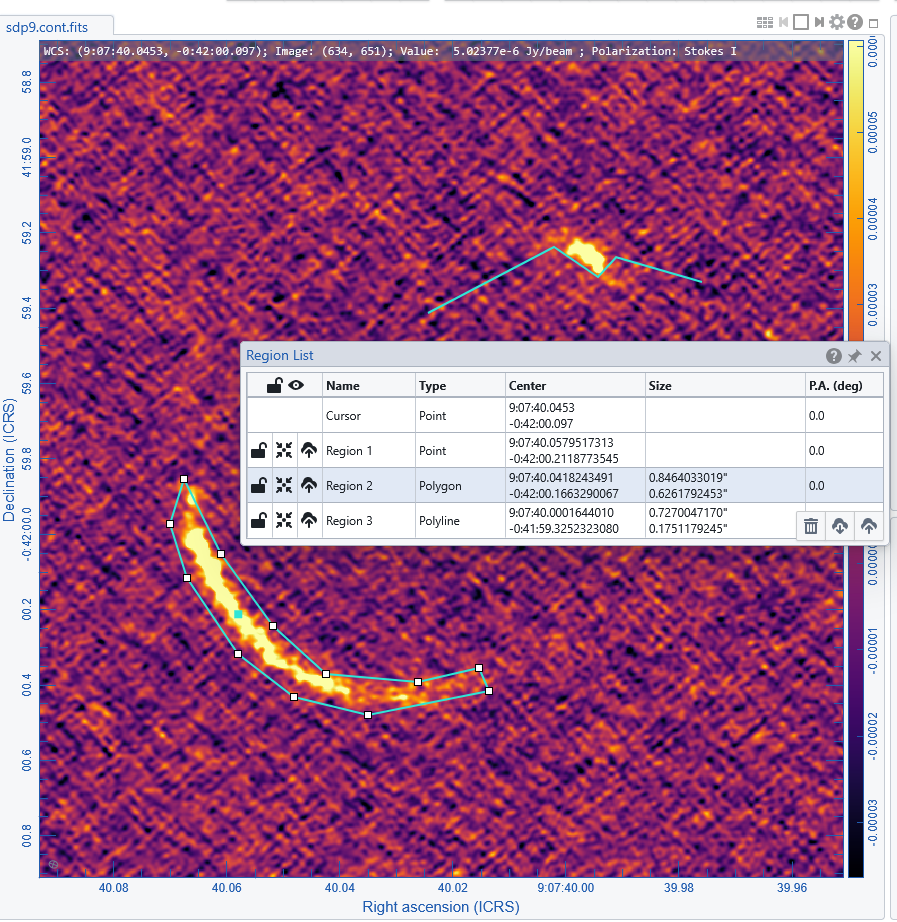

# Regions Definition, Import, and Export

Regions are a core feature of the **CARTA Viewer**, allowing users to define areas of interest on astronomical images for visualization, measurement, and analysis. CARTA provides a variety of region types and flexible tools to create, edit, import, and export them.

---

## ✏️ Defining Regions

Regions can be created interactively using the **toolbar**

-Select the shape (single pixel, line, rectangle, circle, polygonal, polyline, annotation)
-Drag and draw 

For polylines or polygons 
- define control points with left-click, double click to finish.
- double click on control points to delete them
- click on single points and move them

Regions are immediately active and linked to analysis tools such as statistics and spectral profiles. Results update in real time when regions are moved or resized  

Notice that a polyline cannot become a polygon: when you estimate values on polylines they are calculated on the pixels along the line, when you use polygon they are stimated within the area of the polygon.

The list name and properties are added to the Region List Panel.

{: .tip}
Spatial matching to a reference image (by clicking the XY in the matching column of the Image list panel) allows the overlay of regions over all the matched images.

## 📥 Region List Panel

The list of drawn regions is in the Region List Panel
The panel allows to:
- lock a region
- center the image viewer to a region
- export a region
- import more regions
- delete regions (for a single region just select it and Canc, for all the regions use the dust bin button on the bottom right of the panel)

---

## 📥 Importing and Exporting Regions

CARTA allows importing or exporting regions in ds9 or CTRF format .
Regions can be imported and exported through the Region List panel or via the dedicated buttons in the File menu.

[← Previous: Image Management](05_image_management.md) [Next: Guide on plotting Tools →](07_tools.md)
