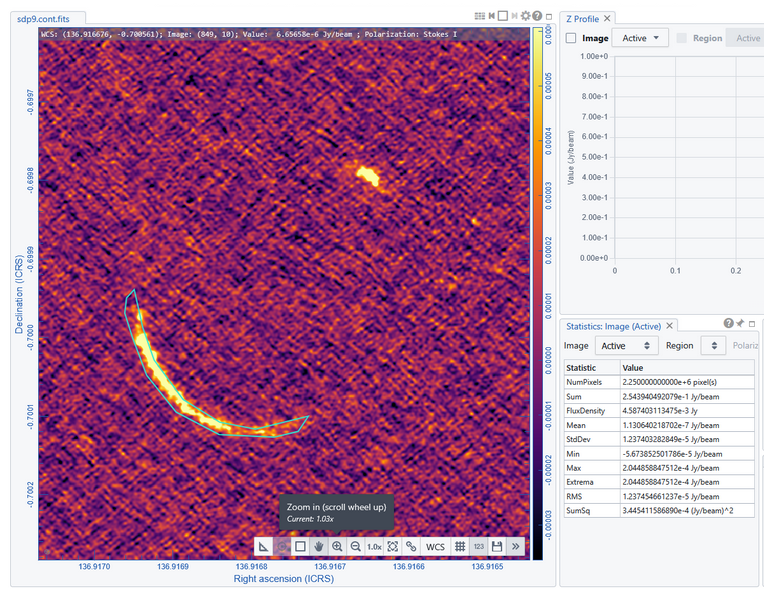
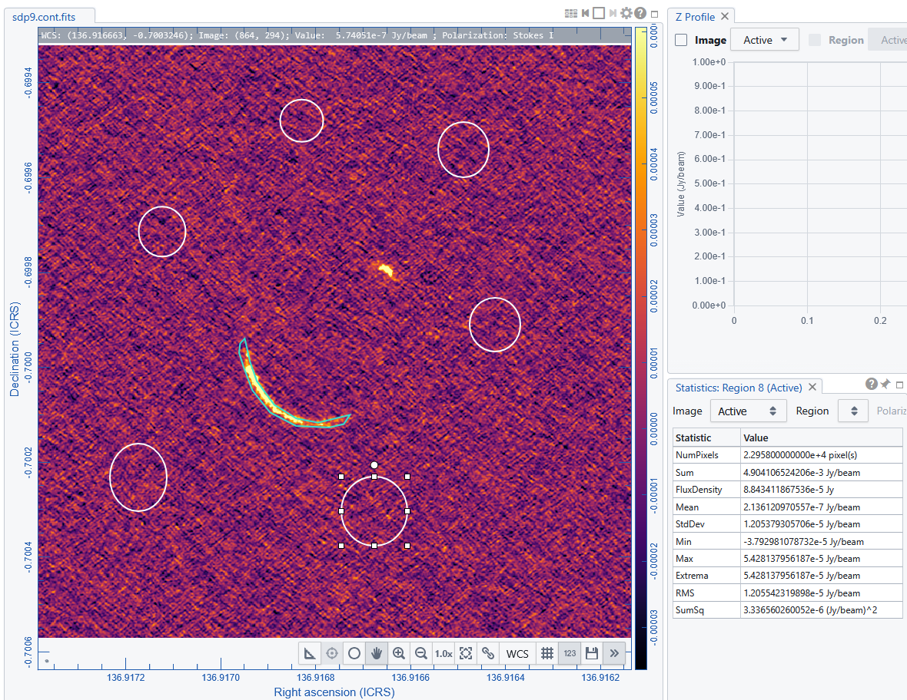

# 📊 Statistics Widget 

The **Statistics Widget** in the CARTA Viewer provides real-time quantitative analysis of image data within a selected region or the entire image. It is a fundamental tool for extracting physical and statistical properties from astronomical datasets.

---

## 🧭 Overview

The Statistics Widget computes numerical summaries of pixel values:

- Within a **selected region** (recommended)
- Or across the **full image** 

Results update dynamically as:
- Regions are moved or resized  
- Channels change in spectral cubes  
- Different images are selected  

---

## ▶️ How to Use

- Load an image or spectral cube  
- Define a **region** (or use the full image)  
- Open the **Statistics Widget**  
- Select: the image and the region of interest  

The widget will immediately display computed values.

---

## 📐 Available Statistical Quantities

Below are the main quantities provided by CARTA, along with their definitions.

- Number of Pixels (NumPixels): Total number of pixels in the selected region.
- Sum: Total sum of pixel values in Jy/beam. 
Sum = ∑i=1N xi
- Flux density: Total flux in Jy. 
- Mean (Average) :Average pixel value in Jy/beam
μ = (1 / N) ∑i=1N xi
- Minimum and Maximum: min max pixel values in Jy/beam 
Min = min(xi), &nbsp;&nbsp; Max = max(xi)
- Standard Deviation (RMS): This is the determination of noise in a region free of signal in Jy/beam

σ = √(
  (1 / N)
  ∑i=1N
  (xi − μ)2
)

- Sum of Squares (SumSq)
∑ xi2

{: .tip}
For radio astronomical images to estimate the flux density of a source consider its extension wrt the rsolving beam.
For an unresolved source the FluxDensity corresponds to the value of the peak pixel.
For an resolved source the FluxDensity item of the widget provide the Integrated Flux Density (already accounting for the transformation between Jy/beam and Jy!!!).

{: .tip}
For radio astronomical images to estimate the noise in an image it is enough to consider the RMS over a region far from the signal (i.e. channels without lines AND far from the emitting sources). For best practice it is recommended to measure the noise values over more than one region and average them.
For each region you can transform the RMS in Jy/beam to Jy by multiplying it for the number of pixels within a beam: you can either draw a region as big as the synthesized beam or take the "Restoring Beam" sizes and "Pixel increment" 
from the file informations of the open or append file browsers, calculate the areas of Beam and pixels and multiply the RMS for their ratio: RMS[Jy]=RMS[Jy/beam]*Beam_area/Pixel_Area

[← Previous: How to define Regions →](06_regions.md)  -   [Next: Guide on plotting Tools](08_tools.md) 