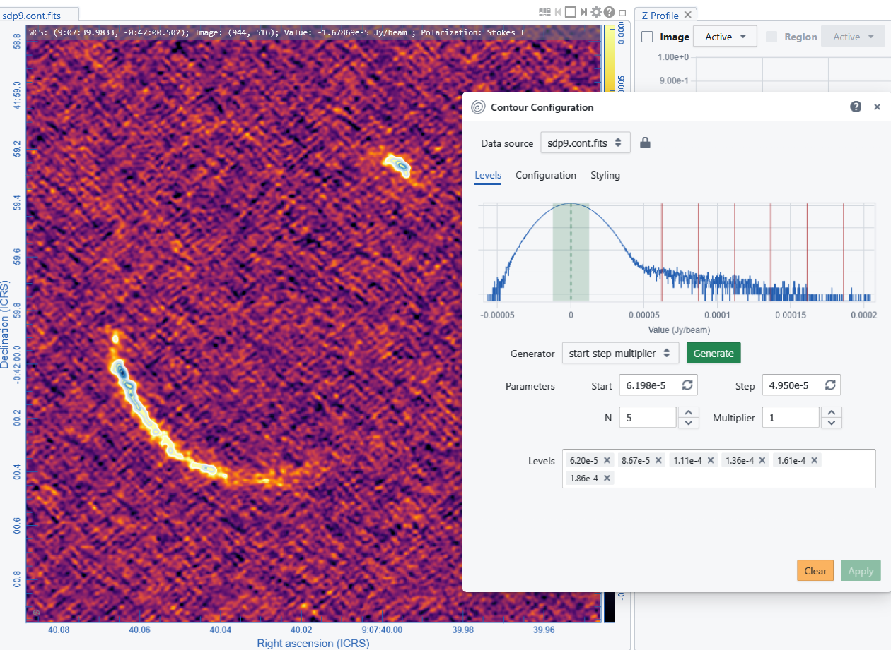
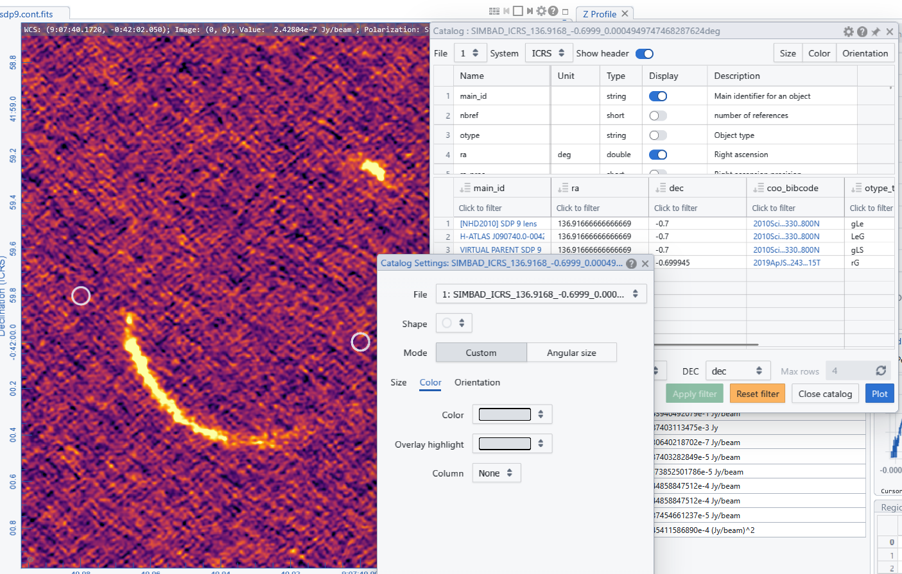
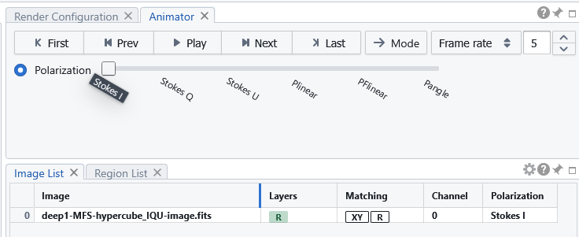
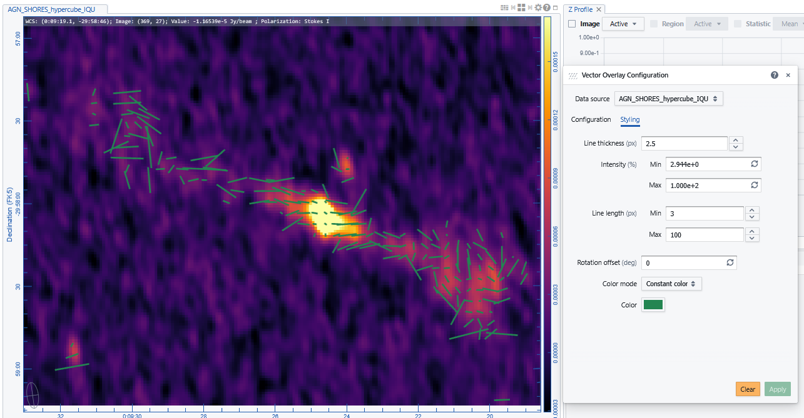
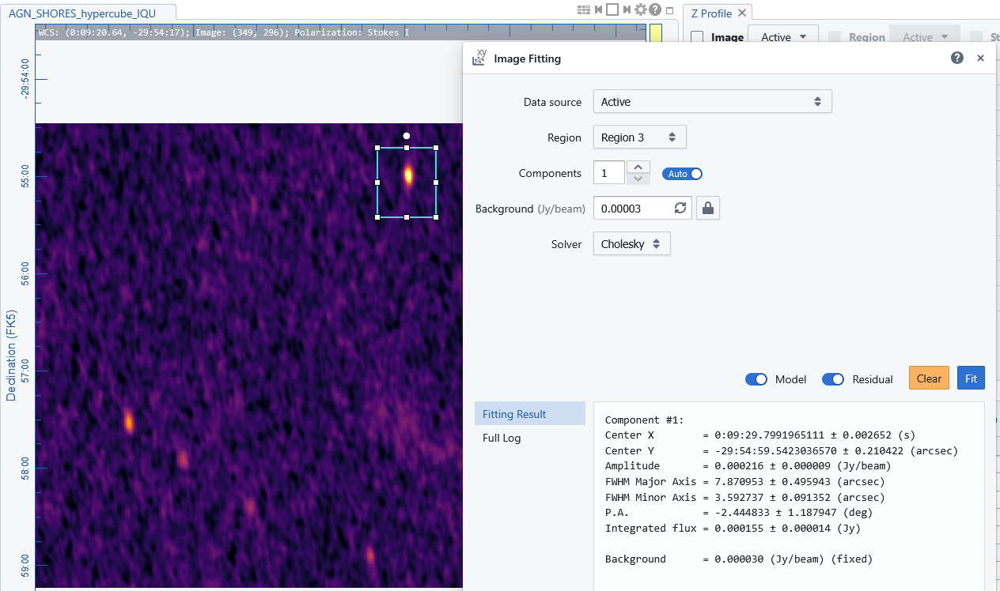

# 📊 Plotting & Overlay Tools in CARTA

The CARTA Viewer provides a powerful set of plotting and overlay tools to enhance visualization and enable deeper analysis of astronomical data. These tools allow users to combine multiple data products, highlight structures, and integrate external information directly within the interface.

---

## 🌀 Overlaying Contours

Contours are used to highlight intensity levels in an image.

- Select the image to use for contours  
- Open the Contour Configuration Panel from the View menu or the Toolbar  
- Define the generator you want to use (start stop multiplier, mix-max scaling, percentages-ref.value, mean-sigma-list) 
- fill the required parameters and click "Generate"
- Define the configuration smoothing and the style (colour, lines, thickness, ...) for plotted contours
- Apply to the image

{: .tip}
Notice that you have to clear contours before applying a new configuration.

The defined contours are deined as a "C" layer in the Image List Panel that can be used to activate or de-activate them.
Only one contour configuration can be loaded for each image, but all the contour layers of the listed images can be plotted to see them overlaid to all the other images (when they are selected).

---

## ⭐ Overlaying Source Catalogues and Online Query

CARTA can display catalogued astronomical sources directly on images.

In Local mode via the File menu "Import Catalogue" it is possible to upload user catalogues in FITS and VO formats 

Via the Online Query widget it is possible to upload SIMBAD and VizieR catalogue files, select and sort the sources and overlay their positions on the maps (costumizing the symbols).

For plotted catalogue sources it is also possible to evaluate scatter and density histograms (see  for more details ).

The Online Query widgets allows also to search for maps .

---

## 🧭 Overlaying Polarization Vectors

Polarization data can be visualized as vectors on the image.
Polarimetric hypercubes are cubes with the Stokes parameter direction (cubes with I,Q, U, and in case also V slices). If separate slices are opened simultaneously "as an hypercube" in the Open File browser, an hypercube is showed and could be navigated with the stokes animator. 

The Vector overlay control panel can then operate on the Hypercube to generate polarization vectors.
The computes polarization intensity, fraction and angle. 
Parameters to be set are thresholding (in the P or I image), and minimum and maximum of plotted polarization intensity (or fraction) and the corresponding length scaling.

---

## 📐 Image Fitting

CARTA provides also tools to fit models directly to image data. 

- Define a region of interest  
- Open the Image Fitting widget
- Decide the image and region to fit
- Decide the initial conditions and run the fit

Fit can be refined by giving the retrieved components parameters as input for following iterations

---

[← Previous: How to define Regions](06_regions.md) [Next: What you need for Spectral analysis →](08_spectral_analysis.md)