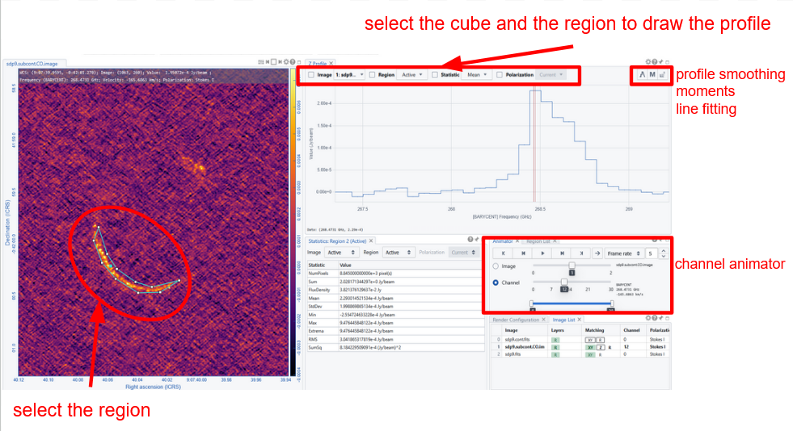
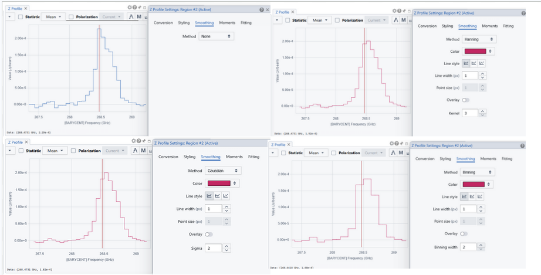
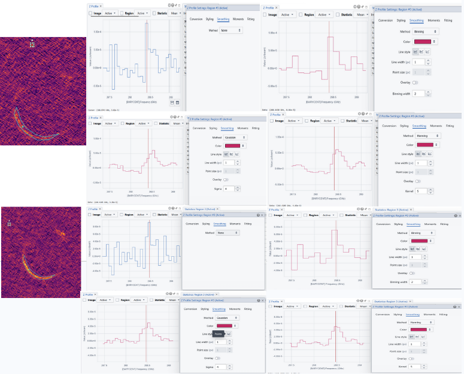

# 📊 Spectral Cube Analysis in CARTA

The **CARTA Viewer** provides a rich set of tools for exploring and analyzing **FITS spectral cubes**, enabling users to study spatial and spectral dimensions simultaneously. These features are particularly useful for radio and millimeter astronomy datasets (e.g., ALMA).

---

## 📈 Viewing a Spectral Profile

A **spectral profile** shows intensity as a function of frequency or velocity for a selected pixel or region.

### How to Display
1. Load a spectral cube  
2. Select a region (or click on a pixel)  
3. Open the **Spectral Profile Widget**  

### Features
- Displays flux vs. channel / frequency / velocity  
- Updates dynamically when:
  - Moving the cursor  
  - Modifying regions  
- Supports multiple regions simultaneously  

---

## 🎚️ Navigating Channels

Spectral cubes contain multiple channels corresponding to different frequencies or velocities.

### Navigation Methods
- **Channel slider** → move through channels interactively  
- **Keyboard shortcuts** → step forward/backward  
- **Animation / playback** → scan through channels automatically  

### Additional Options
- Change axis units (frequency, velocity, channel index)  
- Synchronize channels across multiple frames  

---

## 🧮 Generating Moment Maps

Moment maps summarize spectral information along the spectral axis.

### Common Moments

#### Moment 0 (Integrated Intensity)
- Represents total emission along the spectral axis  

#### Moment 1 (Velocity Field)
- Intensity-weighted mean velocity  

#### Moment 2 (Velocity Dispersion)
- Measures line width or spread  

---

### How to Generate Moment Maps
1. Select the cube in the **File List**  
2. Open the **Moment Map Generator**  
3. Choose:
   - Moment order (0, 1, 2, etc.)  
   - Channel or velocity range  
4. Generate the map  

### Output
- New image layer displayed in CARTA  
- Can be analyzed like any other image  

---

## 📉 Fitting Spectral Lines

CARTA allows fitting analytical models to spectral profiles.

### How to Fit
1. Select a region or pixel  
2. Open the **Spectral Fitting Tool**  
3. Choose a model (e.g., Gaussian)  
4. Adjust initial parameters  
5. Run the fit  

### Features
- Fit one or multiple components  
- Visual overlay of fit on the spectrum  
- Extract parameters such as:
  - Peak intensity  
  - Central velocity  
  - Line width  

---

## 📐 Position–Velocity (PV) Diagrams

PV diagrams show intensity as a function of position and velocity.

### How to Create a PV Diagram
1. Draw a **line or polyline region** across the image  
2. Open the **PV Diagram Tool**  
3. Generate the diagram  

### Features
- Displays a 2D map: position vs. velocity  
- Adjustable slice width  
- Supports curved paths (polylines)  
- Useful for studying kinematics (e.g., rotation, outflows)  

---

## 🔗 Linking Spatial and Spectral Analysis

All tools in CARTA are interconnected:

- Moving regions updates spectra in real time  
- Changing channels updates displayed images  
- PV diagrams and moment maps are linked to the original cube  

---

## ⚡ Performance Advantages

- Real-time interaction with large spectral cubes  
- GPU-accelerated rendering  
- Efficient data streaming (only required channels/tiles)  

---

## 💡 Best Practices

- Use **regions** to reduce noise in spectral profiles  
- Limit channel ranges when computing moment maps  
- Fit spectral lines after smoothing if needed  
- Use PV diagrams to explore velocity structures along specific directions  

---

## 📌 Summary

CARTA provides powerful tools for spectral cube analysis:

- 📈 Interactive spectral profiles  
- 🎚️ Flexible channel navigation  
- 🧮 Moment map generation (0, 1, 2)  
- 📉 Spectral line fitting  
- 📐 PV diagram visualization  

These features enable detailed exploration of the physical and kinematic properties of astronomical sources directly within the viewer.
```


[← Previous: Guide on plotting Tools](07_tools.md) [Next: Survival manual on the Statistics widget →](09_statistics.md)
