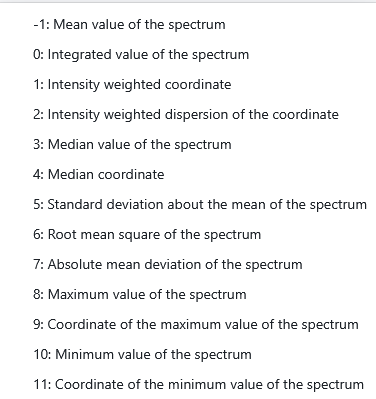
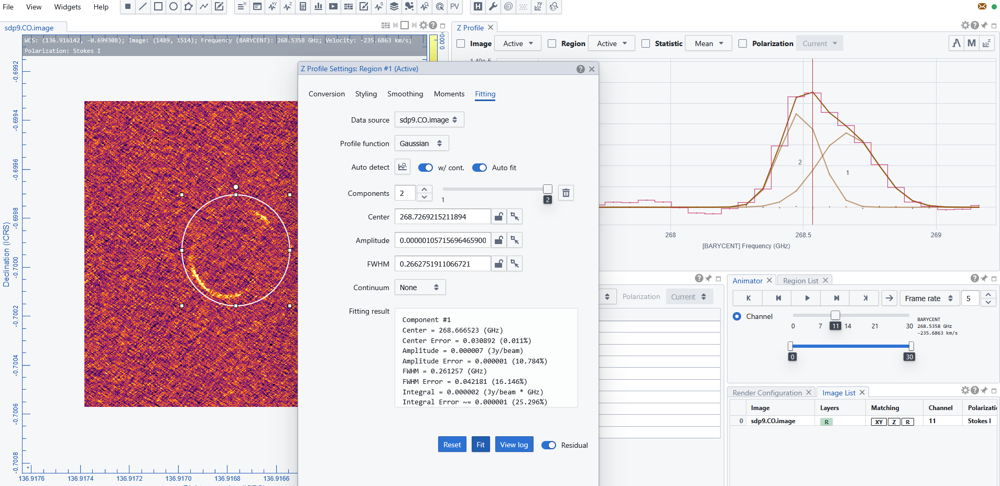
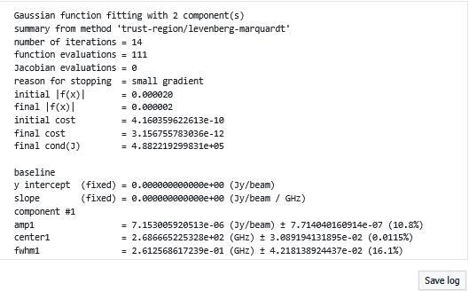

# 📊 Spectral Cube Analysis in CARTA

The **CARTA Viewer** provides a rich set of tools for exploring and analyzing **FITS spectral cubes**, enabling users to study spatial and spectral dimensions simultaneously. These features are particularly useful for radio and millimeter astronomy datasets (e.g., ALMA).

---

## 📈 Viewing a Spectral Profile

A **spectral profile** shows intensity as a function of frequency or velocity for a selected pixel or region.

### How to Display
1. Load a spectral cube  
2. Select a region (or click on a pixel)  
3. Open the **Spectral Profile Widget**  

In the display it is possible to change the visualization unit (frequency/velocity), reference frame, and frequency.
It updates dynamically when the user moves the cursor or modifies the regions  
By hoovering over the profile it is possible to change the visualized channel.

The profile can be zoomed in by selecting a portion of it, and zoomed out double clicking on any region to get back to the original.

It is possible to export the profile as a png image or in a 2 column text file by clicking the dedicated buttons on the bottom right of the widget panel.

## Smoothing
The profile appears as an hystogram per channel. It is possible to rebin or apply smoothing algorithms to the profile to enhance the line profile wrt the noise. To set and/or modify the profile binning it is enough to open the "Smoothing" panel on the top right of the toolbar of the "spectral profile" widget and set the parameter to the desired smoothing method and its styling details. Note that "smoothing" is just one of the windows os the spectral profile settings (i.e. the gear button for this widget).

{: .note}
Note that the smoothing affects only the profile view, NOT the cube rendering or binning in channels.

{: .important}
Avoid eccessive profile smoothing because it can seriously alterate your line profile, or, even worst, identify lines where no line is present, in particular if there is any feature due to noise pattern. There is no way to avoid this: Only experience distinguishes the probability of a real or a fake line.

---

## 🧮 Generating Moment Maps

Moment maps summarize spectral information along the spectral axis.

The most common moments to be generated are:
- Moment 0 (Integrated Intensity): Represents total emission along the spectral axis  
- Moment 1 (Velocity Field): Intensity-weighted mean velocity  
- Moment 2 (Velocity Dispersion): Measures line width or spread  

To Generate Moment Maps:
- open the "moments" panel on the top right of the toolbar of the "spectral profile" widget (also "moments" is just one of the windows os the spectral profile settings i.e. the gear button for this widget)
- decide the region or the whole map for which the moment is needed
- select the range in frequency or velocity where the line is and the pixel values to be included in the evaluation or not.

As the moments generator operates considering the pixel values over the selected region it is important to help the system to focus on regions of high signal to noise, setting a threshold of at least 3 sigma, select only the channels/frequencies/velocities and pixels whose values is clearly above the threshold. 
To do so it is also possible to select the line profile region via the dedicated button in the intervals, and hoovering of the profile to define the ranges.

Finally select the moments (more than one can be listed with spaces or commas as separators) to be generated among those available:

The generator produces the FITS images of the requested moments, opens and adds them to the image list and they can be displayed, customized, and saved/exported as any other image.

---

## 📉 Fitting Spectral Lines

CARTA allows fitting analytical models to spectral profiles.

To Generate Moment Maps:
- open the "fitting" panel on the top left of the toolbar of the "spectral profile" widget (also "fitting" is just one of the windows os the spectral profile settings i.e. the gear button for this widget)
- decide the region or the whole map for which the moment is needed
- select the line shape among Gaussian or Lorentzian
- give hints to the fit (number of components, their center, whidth and amplitude): this can be done automatically selecting the dedicated button and choosing on the profile panel the region where each component is expected. 
- run the fit

The fitting curve is generated and overplotted to the spectral profile for each components.
A log containing the parameters of each component and can be viewed in the fitting panel and saved in a txt file.

{: .tip}
The more precise are the input parameters for the components, the better will be the fit, but caveat not to force the presence of components where there is no evidence of them.

---

## 📐 Position–Velocity (PV) Diagrams

PV diagrams show intensity as a function of position and velocity.

To generate them 
- trace a linear region to indicate the segment of "position" for which you want the "velocity" to be plotted.
- open the PVplot generator widget
- set the region and the range of frequency where the line is found
- run the widget

The generator displays a 2D map: position vs. velocity. 
Once a PV image is generated, it will be loaded and displayed in the Image Viewer. It is named with an additional _pv string in the original input file name. The generated PV image is kept in RAM per session, and if there is a new request for PV image generation, the old PV image will be deleted first. If you want to regenerate a PV image but keep the old one, you can enable the “Keep previous PV image(s)” toggle. Optionally, a calculated PV image can be exported in CASA or FITS format via “File” -> “Save Image”  

[← Previous: Guide on plotting Tools](07_tools.md) [Next: Survival manual on the Statistics widget →](09_statistics.md)
